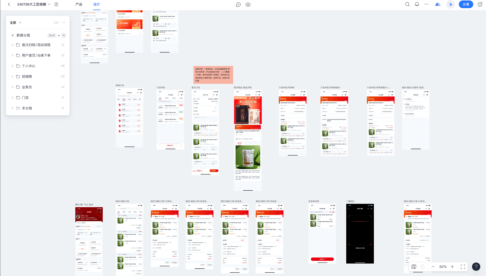
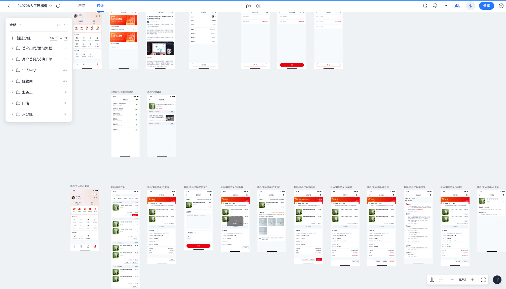
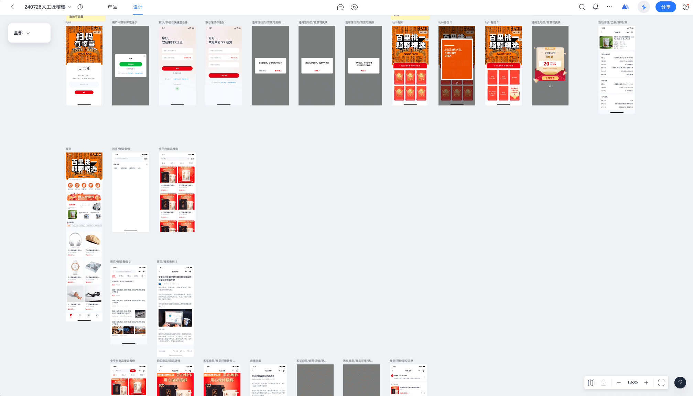

使用duxapp，我是如何实现快速完成项目开发的？

像下面这个例子，这个项目有140多个页面，但是真实的开发时间，在熟练使用duxapp的情况下，不会超过两周，并且可以将它兼容APP、小程序、H5





这里仅展示了其中一部分页面，这个项目主要包含下这些功能

- 购物订单流程
- 售后退换
- 文章发布
- 门店功能
- 送货人员功能
- 经销商功能
- 扫码抽奖
- 等其他功能

下面我将详细介绍使用了哪些方法，来快速完成项目

## 使用全局样式快速布局页面

以这个门店管理首页为例，你可以看到我并没有导入一个`scss`文件，但是我使用了很多的`className`，这些就是用的全局样式，这全局样式都是[duxapp模块提供的](/docs/duxapp/css)

```jsx
import { TopView, Header, Card, Divider, ScrollView, Tag, Row, Image, Column, Text, px, nav, ModalForm, DatePicker, dayjs } from '@/duxui'
import { ArecaIcon, CmsIcon, TipNav, useRequest } from '@/arecaShop'
import { useState } from 'react'

export default function StoreManage() {

  const [date, setDate] = useState()

  const [{ info = {}, sku = {}, distribution = {} }] = useRequest({
    url: 'store/index',
    toast: true,
    data: {
      date
    }
  }, { reloadForShow: true })

  return (
    <TopView>
      <Header title='门店详情' />
      <ScrollView>
        <Card className='p-2 gap-2' margin disableMarginBottom>
          <Row className='gap-2'>
            <Image className='r-2'
              src={info.image}
              style={{ width: px(148) }}
              square
            />
            <Column justify='between' grow>
              <Row justify='between' grow>
                <Text bold size={4}>{info.name}</Text>
                <ArecaIcon name='shezhi' className='text-c1 text-s7'
                  onClick={() => nav('arecaShop/storeManage/info')}
                />
              </Row>
              <Column>
                <Text color={2} size={1}>联系人：{info.contact}</Text>
                <Row grow justify='between' items='center'>
                  <Text color={2} size={1}></Text>
                  <Tag type='secondary' size='s' radiusType='round' onClick={() => nav(`tel:${info.distributor_tel}`)}>
                    <ArecaIcon className='text-white text-s2' name='shiwu-shouji' /> 一键报单进货
                  </Tag>
                </Row>
              </Column>
            </Column>
          </Row>
          <Divider />
          <Row>
            <Text color={2} size={1} shrink>门店地址：</Text>
            <Text bold size={1}>{info.area}{info.address}</Text>
          </Row>
        </Card>
        <TipNav title='货品统计' url='arecaShop/storeManage/mallTotal'>
          <Row className='items-center' grow>
            <ArecaIcon className='text-secondary' name='promot_tips' />
            <Text type='secondary' size={2}>{dayjs().format('MM/DD HH:mm')} 更新</Text>
          </Row>
        </TipNav>
        <Card margin disableMarginBottom className='gap-2'>
          <Text color={3} size={2}>历史进货数量（小包）：{sku.in}</Text>

          <Row justify='between' className='gap-2'>
            <Column grow className='bg-page r-2 p-3 gap-1'>
              <Text color={3} size={2}>历史销售数量（小包）</Text>
              <Text bold size={40}>{sku.out}</Text>
            </Column>
            <Column grow className='bg-page r-2 p-3 gap-1'>
              <Text color={3} size={2}>历史剩余数量（小包）</Text>
              <Text bold size={40}>{sku.supply}</Text>
            </Column>
          </Row>
          <Text size={22} type='secondary'>*销量及剩余仅供参考：记录消费者扫码数量，可能与实际结果有出入</Text>
        </Card>
        <TipNav title='配送记录'
          right={<ModalForm
            title='月份'
            renderForm={<DatePicker
              mode='month'
            />}
            childPropsValueKey='value'
            value={date}
            onChange={setDate}
          >
            <DateChild />
          </ModalForm>}
        ></TipNav>
        <Card margin disableMarginBottom className='gap-2'>
          <Text color={3} size={2}>门店配送（中包）：{distribution.middle_num}</Text>

          <Row justify='between' className='gap-2'>
            <Column grow className='bg-page r-2 p-3 gap-1'
              onClick={() => nav('arecaShop/storeManage/emptyRecovery', { type: 'store' })}
            >
              <Text color={3} size={2}>已结算空袋（小包）</Text>
              <Row items='center' className='gap-1'>
                <Text bold size={40}>{distribution.recycle_num}</Text>
                <CmsIcon className='text-c3 text-s5' name='direction_right' />
              </Row>
            </Column>
            <Column grow className='bg-page r-2 p-3 gap-1'
              onClick={() => nav('arecaShop/storeManage/deliveryList')}
            >
              <Text color={3} size={2}>门店已退货数（小包）</Text>
              <Row items='center' className='gap-1'>
                <Text bold size={40}>{distribution.refund_num}</Text>
                <CmsIcon className='text-c3 text-s5' name='direction_right' />
              </Row>
            </Column>
          </Row>
        </Card>
      </ScrollView>
    </TopView>

  )
}

const DateChild = ({ value, onClick }) => {
  return <Row items='center' className='r-2 ph-2 bg-white gap-1' onClick={onClick}>
    <Text color={value ? 1 : 3}>{value || '请选择'}</Text>
    <ArecaIcon name='rili1' className='text-c3' />
  </Row>
}
```

## 使用UI库

在上面的示例中已经展示了如何使用UI库的组件，可以看到使用了UI库的组件，在结合全局样式，你会发现，似乎不需要编写scss就能很好的完成页面布局了

这些组件都是[duxui UI库](/docs/duxui/start)提供的

## 使用List组件完成列表页面

以下面这个列表页面为例，List组件帮你完成了数据请求、自动分页、下拉刷新、自动刷新等功能，你只需要关注你列表中的每一项是如何编写的

```jsx
import { TopView, Header, Card, Tab, TabItem, Row, Image, Column, Text, px, Empty, DatePicker, SelectorPicker, ModalForm, Button } from '@/duxui'
import { ArecaIcon, List, usePageData, nav } from '@/arecaShop'
import { useState } from 'react'

export default function DeliveryList() {

  const [users] = usePageData('store/salesman')

  const [user, setUser] = useState()

  const [type, setType] = useState(0)

  return (
    <TopView>
      <Header title='配送记录' />
      <Tab className='bg-white' value={type} onChange={setType}>
        <TabItem title='门店配送' paneKey={0} />
        <TabItem title='门店退货' paneKey={1} />
      </Tab>
      <Row className='ph-3 mt-3' items='center' justify='between'>

        <ModalForm
          title='业务员'
          renderForm={<SelectorPicker range={users} nameKey='nickname' valueKey='id' />}
          childPropsValueKey='value'
          value={user}
          onChange={setUser}
        >
          <SelectChild />
        </ModalForm>

      </Row>

      <List
        key={type}
        renderItem={Item}
        renderEmpty={<Empty title='暂无记录' />}
        url={type ? 'store/refund' : 'store/distribution'}
        data={{
          salesman_id: user
        }}
      />
    </TopView>
  )
}

const SelectChild = ({ value, ...props }) => {

  return (
    <Row items='center'  {...props}>
      <Text size={2}>{value || '全部业务员'}</Text>
      <ArecaIcon name='arrow_down_fill' className='text-s4 text-c2' />
    </Row >
  )
}

const Item = ({ item }) => {
  return <Card margin disableMarginBottom className='gap-3'>
    <Row items='center'>
      <ArecaIcon className='text-c1 text-s7' name='store' />
      <Text size={2} style={{ marginLeft: px(4) }}>{item.store_name}</Text>
      <ArecaIcon className='text-c3 text-s5' name='you2' />
    </Row>
    {
      item.goods.map(good => <Row className='gap-3' key={good.id}>
        <Image style={{ width: px(160) }} square className='r-2' src={good.image} />
        <Column grow justify='between'>
          <Text size={2} bold numberOfLines={2}>{good.title}</Text>
          <Text size={2} color={3}>规格：{good.spec}</Text>
          <Text size={2} color={3}>数量：{good.num}</Text>
        </Column>
      </Row>)
    }

    <Column className='r-2 bg-page p-3 gap-2'>
      <Row>
        <Row grow items='center'>
          <ArecaIcon className='text-secondary text-s7' name='man_mine' />
          <Text size={2}>{item.salesman_name || '-'}</Text>
        </Row>
        <Row grow items='center'>
          <ArecaIcon className='text-secondary text-s7' name='shiwu-shouji' />
          <Text size={2}>{item.salesman_tel || '-'}</Text>
        </Row>
      </Row>
      <Row>
        <Row grow items='center'>
          <ArecaIcon className='text-secondary text-s7' name='map' />
          <Text size={2}>{item.area}</Text>
        </Row>
        <Row grow items='center'>
          <ArecaIcon className='text-secondary text-s7' name='shijian1' />
          <Text size={2}>{item.created_at}</Text>
        </Row>
      </Row>
    </Column>
  </Card>
}
```

## 使用hook快速请求数据

这里是指的使用`useRequest`替代`request`快速获取数据，而不需要在编写具体请求逻辑

```jsx
import { TopView, Header, Card, Text, ScrollView, Space, HtmlView, useRoute } from '@/duxui'
import { useRequest } from '@/arecaShop'

export default function HelpDetail() {

  const { params } = useRoute()

  const [detail] = useRequest(`tools/magic/help/${params.id}`)

  return (
    <TopView isSafe>
      <Header title='帮助详情' />
      <ScrollView >
        <Card shadow={false} margin>
          <Space size={32}>
            <Text bold size={42} >{detail.title}</Text>
            <HtmlView html={detail.content} />
          </Space>
        </Card>
      </ScrollView>
    </TopView>
  )
}
```

## 使用现有模块

这个项目中的 购物订单流程、售后退换、文章发布等功能，在之前的模块中都已经是开发过的功能，并且他们都是成熟可用的，我们只需要直接使用他们就行了

```json
{
  "name": "arecaShop",
  "description": "大工匠槟榔商城",
  "version": "1.0.0",
  "dependencies": [
    "duxcmsMall",
    "amap"
  ]
}
```

在我这个项目模块的配置文件中，将 `duxcmsMall` 添加到依赖中，这是商城模块他提供了商品、订单、售后、购物车、收货地址等功能

因为当前项目需求是积分兑换商品，但是默认的商城不支持积分功能，下面介绍是使用渲染钩子来修改为积分商品

## 使用渲染钩子对商城进行修改

使用RenderHook，将商城购物流程修改为积分兑换流程，这个文件需要在模块入口文件中导入

```jsx
import { mallHook, orderHook, Price } from '@/duxcmsMall'
import { Card, contextState, Row, Text } from '@/duxui'

const ListPrice = ({ item, children }) => {
  if (item.type === 'point') {
    return <Text bold size={4} type='danger'>{item.sell_point}积分</Text>
  }
  return children
}

mallHook.add('goods.list.item.sellPrice', ListPrice)
mallHook.add('MallCateQuick.item.sellPrice', ListPrice)
mallHook.add('MallList.item.sellPrice', ListPrice)

mallHook.add('detail.info.price', ({ children }) => {

  const [data] = contextState.useState()

  if (data.type !== 'point') {
    return children
  }

  return <Row className='gap-2' items='center'>
    <Text size={40} bold color={4}>
      {data.sell_point}积分
    </Text>
    <Price size={1} delete color={4} className='mt-2'>{data.market_price}</Price>
  </Row>
})

mallHook.add('GoodsSpec.price', ({ children, data, item }) => {
  if (data.type !== 'point') {
    return children
  }
  return <Text size={48} bold type='danger'>
    {item?.sell_point || data.sell_point}积分
  </Text>
})

orderHook.add('order.create.data.total', ({ store }) => {

  // const isPoint = store.items.some(v => v.type === 'point')

  return <>
    <Row items='center' justify='between'>
      <Text bold>商品金额</Text>
      <Price color={2}>{store.total.order_price}</Price>
    </Row>
    <Row items='center' justify='between'>
      <Text bold>运费</Text>
      <Price color={2}>{store.total.delivery_price}</Price>
    </Row>
    {
      store.discount.map(item => <Row key={item.name} items='center' justify='between'>
        <Text bold>{item.desc}</Text>
        <Text type='danger'>-¥{item.price}</Text>
      </Row>)
    }
    {/* {+store.total.discount_price > 0 && <Row items='center' justify='between'>
      <Text bold>{isPoint ? '积分抵扣' : '优惠'}</Text>
      <Price type='danger'>{-store.total.discount_price}</Price>
    </Row>} */}
  </>
})

orderHook.add('order.detail.total', () => {
  const [{ data }] = contextState.useState()

  return <Card margin disableMarginBottom className='gap-3'>
    <Row items='center' justify='between'>
      <Text color={2}>订单总额</Text>
      <Price bold color={1}>{data.order_price}</Price>
    </Row>
    <Row items='center' justify='between'>
      <Text color={2}>运费</Text>
      <Price bold color={1}>{data.delivery_price}</Price>
    </Row>
    {
      data.discount_data?.map(item => <Row key={item.name} items='center' justify='between'>
        <Text color={2}>{item.desc}</Text>
        <Text bold type='danger'>-¥{item.price}</Text>
      </Row>)
    }
    <Row items='center' justify='between'>
      <Text color={2}>实付款</Text>
      <Price bold type='primary'>{data.pay_price}</Price>
    </Row>
  </Card>
})
```

## 总结

上面提到的就是用于快速开发的主要方法，当你熟练掌握这些方法后，你的开发速度将一骑绝尘

当然这些上面提到这些并不是全部，你可以阅读开发文档，从中获取更多的使用方法
