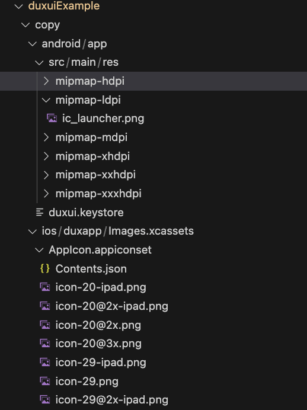

Taro的React Native端开发提供了两种开发方式，一种是将壳和代码分离，一种是将壳和代码合并在一起开发

:::info
- 壳是用来打包调试版或者发版安装包使用的
- 代码是运行在壳上的js代码
- Taro壳子的代码仓库[https://github.com/NervJS/taro-native-shell](https://github.com/NervJS/taro-native-shell)
:::

duxapp中更进一步，你不需要太关注壳子什么的，你只需要安装好安卓和ios的编译环境，用一个命令就能编译apk或者ios，并且这个编译的过程和duxapp的模块化理念高度绑定，通过指定 `--app=` 指定不同的入口，就能打包出不同的项目，就像下面这样

```bash
# 编译 duxuiExample 的安卓调试版本
yarn android --app=duxuiExample

# 编译 duxuiExample 的IOS调试版本
yarn ios --app=duxuiExample

# 编译成功后启动Metro代码编译服务
yarn start --app=duxuiExample
```

下面我来详细介绍一下，在duxapp中是如何对RN进行优化的

## 配置化

对于Taro的壳子，或者原生React Native，都会存在 `android` `ios`这两个文件夹，而在duxapp中，这些文件夹的内容是自动生成的，那么对于需要在这些文件夹中修改的配置内容，例如包名、版本号、新架构开关等，都通过配置文件的方式配置了，而不需要需修改具体的文件

这个配置文件是项目配置文件夹下的 `configs/duxuiExample/duxapp.rn.js`，其中 duxuiExample 就是我通过`--app=duxuiExample` 指定的入口模块

这个配置文件的内容就像下面这样，可以清晰的看到，对安卓配置了包名、名称、版本号等信息，IOS同样如此

```js
const config = {
  android: {
    appid: 'cn.duxapp.duxui',
    appName: 'duxUI库',
    versionCode: 2,
    versionName: '1.1.0',
    keystore: {
      storeFile: 'duxui.keystore',
      keyAlias: 'duxui',
      storePassword: 'TN62eyasJAKm2ksD',
      keyPassword: 'TN62eyasJAKm2ksD'
    }
  },
  ios: {
    BundleId: 'cn.duxapp.duxui',
    appName: 'duxUI库',
    versionCode: 1,
    versionName: '1.0.0',
    team: '',
    plist: {
      'duxapp/Info.plist': {
        NSCameraUsageDescription: 'duxUI库需要拍照用于APP内图片上传更换头像',
        NSContactsUsageDescription: 'duxapp需要访问你的通讯录，将客户信息保存到通讯录中',
        NSLocalNetworkUsageDescription: 'App需要访问你的本地网络，用于和服务器建立连接',
        NSLocationAlwaysAndWhenInUseUsageDescription: '使用你的位置信息用于地图定位和位置选择',
        NSLocationAlwaysUsageDescription: '使用你的位置信息用于地图定位和位置选择',
        NSLocationWhenInUseUsageDescription: '使用你的位置信息用于地图定位和位置选择',
        NSPhotoLibraryAddUsageDescription: 'duxUI库需要保存宣传图到你的相册用于分享',
        NSPhotoLibraryUsageDescription: 'duxUI库需要访问相册用于APP内图片上传更换头像',
      }
    }
  }
}

module.exports = config
```

## 内容复制

上面这个配置文件已经解决了大部分打包需要用到的配置，但是你开发过RN的话你会看出来，证书他是一个文件，这里只指定了证书文件名称，但是并未指定证书具体内容，还有打包一个app，它总是需要一个app图标的，包括安卓和ios的图标，那么这些内容，可以通过配置文件中的copy文件夹，将这些项目文件复制到安卓或者ios对应的文件位置

这个文件夹内容看起来是这样的



那么你又会发现，好像这些文件的结构，以及如何生成这些文件，又是一个头疼的问题，`duxapp-cli`，帮你解决了这个麻烦的问题，只需要两个简单的命令，就可以自动创建这个些文件

首先是安卓证书文件，需要注意的是，这里是指定`--config=`，而不是指定 `--app=`

```bash
yarn duxapp android keystore --config=duxuiExample
```

创建成功后，需要手动将命令行打印的配置内容，放进duxapp.rn.js相应位置

然后是logo创建，需要将你项目的logo文件放在配置文件根目录，也就是 `configs/duxuiExample/logo.png`

```bash
yarn duxapp rn logo --config=duxuiExample
```

命令使用成功后，他会自动把logo放进对应位置，你就不需要进一步操作了

这样是不是就简单起来了，下面来看看，要如何使用第三方插件，例如微信插件、高德地图插件等

:::info
以上所有提到的 `duxuiExample` 都是以 UI库示例 这个模块项目来举例的，在你的项目中根据实际情况替换
:::

## 三方模块

你的项目或多或少都要用一些第三方的插件，`React Native`基础模块中已经包含了很多基础常用插件，你可以通过[三方模块](http://duxapp.com/docs/app/duxappReactNative/start#三方模块)查看到，包含的基础插件

传统的方法是将他们添加到 `package.json` 依赖中，然后根据文档内容修改安卓或者ios文件夹对应的内容，在duxapp中提供了另外一种方式来实现第三方插件的使用

像这个`react-native-view-shot`安装方式很简单的插件，他只要求你将他添加到 `package.json` 的依赖中就可以使用了

那么我们结合模块，在你需要用到这个功能的模块配置文件中，一样的添加上这个依赖即可，像下面这个`duxui`模块的`package.json`文件一样

```json
{
  "dependencies": {
    "b-validate": "^1.5.3",
    "react-native-view-shot": "~3.8.0",
    "react-native-fast-shadow": "~0.1.1",
    "array-tree-filter": "^2.1.0"
  }
}
```

其实开源的大多数第三方插件都是这样的，只需要添加到依赖中，重新打包就能用了，但是很少数的插件，他就是要改一些安卓或者ios里面的原生内容，像微信插件，它需要的改动还挺多的，我根据他文档需求，列举了下面这些

安卓：
- 添加 proguard
- 新建 `WXEntryActivity.java` 用于回调处理
- 新建 `WXPayEntryActivity.java` 用于支付回调处理
- 添加 `<package android:name="com.tencent.mm" />` 用于跳转到微信的白名单
- 添加 `.wxapi.WXEntryActivity`
- 添加 `.wxapi.WXPayEntryActivity`

ios：  
- 由于插件bug，需要添加 pod 依赖项 `pod 'WechatOpenSDK'`
- 修改 `AppDelegate.h` 入口文件
- 修改 `AppDelegate.mm` 文件进行一些处理
- 在 `Info.plist` 添加 Schemes 和 BundleURLTypes 和 applinks
- 在项目配置中，添加 `UniversalLink`

其他：
- 通过patch修复当前版本的一个bug 

首先还是要在模块中添加依赖 `package.json` 文件
```json
{
  "dependencies": {
    "react-native-wechat-lib": "^3.0.4",
    "wechat-jssdk": "^5.1.0"
  }
}
```

那么在duxapp前面提到，安卓和ios文件夹的内容都是自动生成的，我又是如何处理这些修改的呢？这里就需要用到 duxapp-cli 提供的模块更新脚本来处理

针对微信插件的处理脚本文件位于 `src/wechat/update/index.js`，这个文件的内容是下面这样的

```js
// eslint-disable-next-line import/no-commonjs
module.exports = ({ config }) => {
  const { android, option } = config
  return {
    // 描点插入
    insert: {
      'android/app/proguard-rules.pro': {
        'content': `
  ##### 微信 ######
  -keep class com.tencent.mm.opensdk.** { *; }
  -keep class com.tencent.wxop.** { *; }
  -keep class com.tencent.mm.sdk.** { *; }`
      },
      'ios/Podfile': {
        'podEnd': `  pod 'WechatOpenSDK'`
      },
      'ios/duxapp/AppDelegate.h': {
        import: '  #import "WXApi.h"',
        'appDelegate.protocol': '  ,WXApiDelegate'
      },
      'ios/duxapp/AppDelegate.mm': {
        import: '#import <React/RCTLinkingManager.h>',
        appDelegate: `// react-native-wechat-lib start

  - (BOOL)application:(UIApplication *)application handleOpenURL:(NSURL *)url {
      return  [WXApi handleOpenURL:url delegate:self];
  }

  - (BOOL)application:(UIApplication *)application
    continueUserActivity:(NSUserActivity *)userActivity
    restorationHandler:(void(^)(NSArray<id<UIUserActivityRestoring>> * __nullable
    restorableObjects))restorationHandler {
    // 触发回调方法
    [RCTLinkingManager application:application continueUserActivity:userActivity restorationHandler:restorationHandler];
    return [WXApi handleOpenUniversalLink:userActivity
    delegate:self];
  }

  // Universal Links 配置文件, 没使用的话可以忽略。
  // ios 9.0+
  - (BOOL)application:(UIApplication *)application openURL:(NSURL *)url
              options:(NSDictionary<NSString*, id> *)options
  {
    // Triggers a callback event.
    // 触发回调事件
    [RCTLinkingManager application:application openURL:url options:options];
    return [WXApi handleOpenURL:url delegate:self];
  }
  // react-native-wechat-lib end`
      }
    },
    create: {
      'android/app/src/main/java/cn/duxapp/wxapi/WXEntryActivity.java': `package ${android.appid}.wxapi;

import android.app.Activity;
import android.os.Bundle;
import com.wechatlib.WeChatLibModule;

public class WXEntryActivity extends Activity {
  @Override
  protected void onCreate(Bundle savedInstanceState) {
    super.onCreate(savedInstanceState);
    WeChatLibModule.handleIntent(getIntent());
    finish();
  }
}
`,
      'android/app/src/main/java/cn/duxapp/wxapi/WXPayEntryActivity.java': `package ${android.appid}.wxapi;

import android.app.Activity;
import android.os.Bundle;
import com.wechatlib.WeChatLibModule;

public class WXPayEntryActivity extends Activity {
  @Override
  protected void onCreate(Bundle savedInstanceState) {
    super.onCreate(savedInstanceState);
    WeChatLibModule.handleIntent(getIntent());
    finish();
  }
}
`
    },
    android: {
      xml: {
        'app/src/main/AndroidManifest.xml': {
          tag: {
            queries: {
              child: '<package android:name="com.tencent.mm" />'
            }
          },
          attr: {
            'android:name=".MainApplication"': {
              child: `<activity
                android:name=".wxapi.WXEntryActivity"
                android:label="@string/app_name"
                android:exported="true"
                android:taskAffinity="${android.appid}"
                android:launchMode="singleTask"
              />
              <activity
                android:name=".wxapi.WXPayEntryActivity"
                android:label="@string/app_name"
                android:exported="true"
              />`
            }
          }
        }
      }
    },
    ios: {
      plist: {
        'duxapp/Info.plist': {
          CFBundleURLTypes: [
            {
              CFBundleTypeRole: 'Editor',
              CFBundleURLName: 'weixin',
              CFBundleURLSchemes: [
                option?.wechat?.appid || 'wx'
              ]
            }
          ],
          LSApplicationQueriesSchemes: ['weixin', 'wechat', 'weixinULAPI']
        },
        'duxapp/duxapp.entitlements': {
          'com.apple.developer.associated-domains': [
            `applinks:${option?.wechat?.applinks || 'duxapp.com'}`
          ]
        }
      }
    }
  }
}
```

这个文件导出了一个函数，这个函数参数中的 config 就是当前项目的RN编译配置文件，这个文件中可以获取到了包名、版本号等信息

函数返回了一个对象，这个对象中的每一个key就代表不同的功能，下面一一介绍一下这些key

- insert 用于将内容插入到指定文件的指定位置
- create 用于将文件创建于指定位置
- android 其中的xml用来处理合并安卓中的xml文件的，这是用 [`xmldom`](https://github.com/xmldom/xmldom)来实现的
- ios 其中的plist是用来合并ios的plist配置文件的

关于这个脚本文件的详细内容需阅读 [使用原生模块](/docs/course/rn/package) 了解详情

看了半天，是不是感觉这个模块处理也是挺复杂的，其实我已经封装了一些常用的原生模块，就像这个微信插件，你不需要再去实现一遍，你只需要安装这个微信模块并把他添加到你项目模块的依赖中就能使用了

```bash
yarn duxapp app add wechat
```

然后就像 `duxuiExample` 这个模块的配置文件一样，将 `wechat` 添加到依赖中，然后重新编译

```json
{
  "name": "duxuiExample",
  "description": "ui库示例",
  "version": "1.0.13",
  "dependencies": [
    "duxui",
    "duxcms",
    "amap",
    "echarts",
    "wechat"
  ]
}
```

还有更多的模块，请前往应用商店查看 [https://www.dux.cn/page/apps](https://www.dux.cn/page/apps)

## 总结

通过上面的说明，你已经基本了解了duxapp是如何处理RN端开发的，还有很多的详细的内容，还需要前往文档查看[http://duxapp.com/docs/course/rn/start](http://duxapp.com/docs/course/rn/start)

再结合duxapp提供的ui库、工具库、全局样式等方法，就能很快的完成你的APP项目了

GitHub：[https://github.com/duxapp](https://github.com/duxapp)