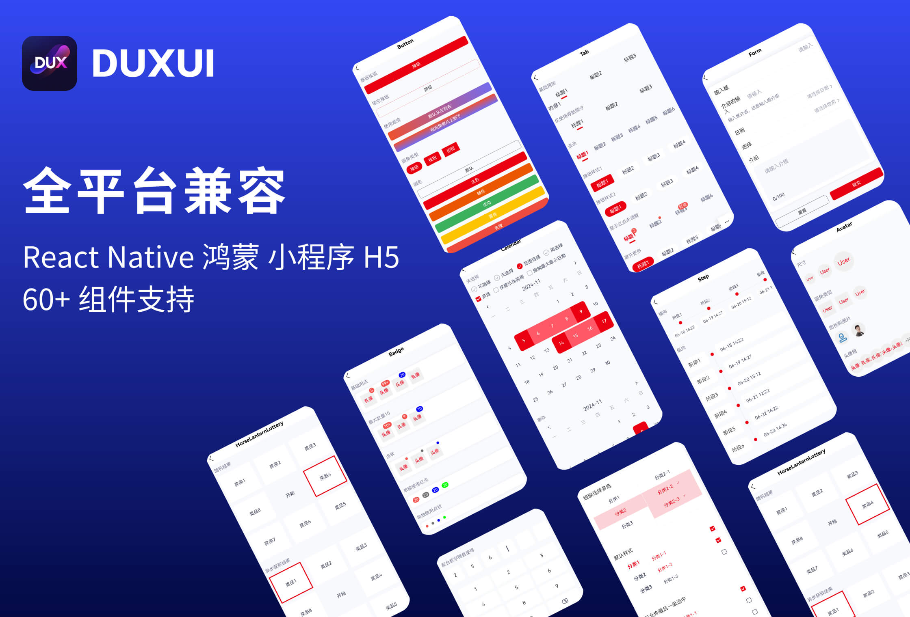

Taro 4.0 已经推出一段时间了，4.0 版本主要是支持了鸿蒙端的开发以及 Vite 编译工具的支持。duxapp 在这段时间也跟随 Taro 的脚步，实现的对鸿蒙端的支持，并且也将之前的 duxui 这个多端的 UI 库，对鸿蒙端实现了兼容。

duxui 组件库提供了 60+ 的组件支持，能快速帮助你完成业务。

现在使用这个 UI 库，不仅能开发鸿蒙，还能实现同时开发 React Native、小程序和 H5，也是目前唯一一个能兼容这么多端的 UI 库。

## 组件展示



下面我将介绍这一切是如何做到的，这其中遇到了哪些问题

## 兼容鸿蒙之前

在开始兼容鸿蒙之前，我们来讲一下，duxapp 是一个什么状况

### 1、样式兼容性

现在 duxapp 已经兼容 小程序、React Native以及H5了，因为 React Native 端在这些端中兼容的样式是最少的，我们是按照React Native的标准去做，我们针对 H5 端和 小程序端的基础样式做了调整

需要将 View 组件调整为默认 Flex 竖向布局、默认的定位方式、模型盒、以及边框等，像下面这样：

```css
/* H5 端 */
taro-view-core {
  display: flex;
  flex-direction: column;
  position: relative;
  border-style: solid;
  border-width: 0;
}
input,
textarea,
taro-view-core {
  box-sizing: border-box;
}
/* 小程序端 */
view {
  display: flex;
  flex-direction: column;
  position: relative;
  border-style: solid;
  border-width: 0;
}
input,
textarea,
view {
  box-sizing: border-box;
}
```

通过这样的调整，我们在项目中使用 View 组件的时候将默认使用 Flex 竖向布局，这样编写的 css 就能做到同时兼容多个端了

### 2、现有模块

duxapp 框架中现在已提供了很多的公开模块了，这里介绍三个相关的基础模块，这三个模块在我们兼容鸿蒙的过程中都有很大的关联

- duxapp

这个和框架名称相同的模块，是所有模块的根模块，所有的模块都需要依赖于这个模块

这个模块内提供了一些非常基础的组件、函数、配置等，且一些东西是必须使用的

> 用来包裹页面的容器组件 `TopView`  
> 路由跳转函数 `route`  
> 导出的用户配置  

- duxui

这个是提供的UI组件库，模块内提供了大量兼容多端的组件库，使用这些组件，能快速开发出兼容多端的应用

- duxappReactNative

React Native端支持，要兼容 React Native，必须使用这个模块，模块内有 React Native 端的三方依赖、用户协议、版本更新、权限管理等

## Taro 和鸿蒙的现状

Taro 4.0 目前有两套实现鸿蒙的方案

- @tarojs/plugin-platform-harmony-hybrid

webview方案，将 H5 运行在 webview 上，和小程序类似

- @tarojs/plugin-platform-harmony-ets

> duxapp 中为了更好的性能和体验，选择的的是这个方案

底层通过 arkts 以及 arkui 实现，将 Taro 的组件转化为对应的 arkui 里面对应的组件，并实现了 React 的运行时

例如 `View` 组件会通过 arkui 的 `Flex`、`Row`、`Column` 这三个组件来实现，会根据编写的不同样式选择不同的原生组件去渲染，从这里也大概能看出，鸿蒙的 arkui 里面也是 Flex 布局

## 兼容过程

### 1、创建一个鸿蒙模块

就像上面介绍的 React Native 端那样，鸿蒙端也需要创建一个模块，用来处理鸿蒙端的基础内容，例如用到的三方依赖、配置插件等

这个模块的名称为 `duxappHarmony`

### 2、添加需要的三方依赖

目前鸿蒙端仅支持使用 `vite` 编译，因此鸿蒙端需要添加编译的相关的依赖，在模块内创建 `package.json`，内容如下

```json
{
  "scripts": {
    "build:harmony": "duxapp runtime enterFile && duxapp harmony create && taro build --type harmony",
    "dev:harmony": "npm run build:harmony -- --watch"
  },
  "dependencies": {
    "@tarojs/plugin-platform-harmony-ets": "4.0.7",
    "vite": "^5.4.10",
    "terser": "^5.36.0",
    "@tarojs/vite-runner": "4.0.5",
    "@vitejs/plugin-react": "^4.3.3",
    "vite-plugin-commonjs": "^0.10.3"
  }
}
```

这个完整的文件中还包含了编译鸿蒙的两个命令

### 3、配置依赖项

添加了依赖这些依赖并不会自动起作用，需要配置 Taro 编译配置，我们在这个模块内创建一个 Taro 的配置文件 `taro.config.js`，内容如下

```js
// eslint-disable-next-line import/no-commonjs
const commonjs = require('vite-plugin-commonjs').default

module.exports = {
  // 鸿蒙编译插件
  plugins: [
    '@tarojs/plugin-platform-harmony-ets'
  ],
  harmony: {
    compiler: {
      // 指定 vite 编译
      type: 'vite',
      vitePlugins: [
        commonjs()
      ]
    },
    projectPath: './dist/harmony'
  }
}
```

这里面配置了平台插件、指定使用 vite 编译、设置了项目目录

> 这其中还加入了一个 vite 插件，因为 vite 默认不支持 commonjs，但是 duxapp 项目中使用了commonjs，所以加入了这个插件

到此基础环境配置好了，但是我们还需要创建鸿蒙工程文件，Taro 没有提供这个内容

### 4、在cli内处理鸿蒙工程文件

在第 2 步的命令中，`duxapp harmony create` 有这个命令，我们就是通过这个命令来创建的鸿蒙工程文件，这样就不需要再通过鸿蒙的 IDE 再去手动操作创建了，这也是一个相对麻烦的过程

这个过程和 React Native 端是类似的，React Native端也是自动创建安卓和 ios 的工程文件，鸿蒙的工程文件创建会放在 `dist/harmony` 目录中

创建工程文件的过程中，可以通过配置或脚本对工程文件进行处理，例如鸿蒙端需要包名、版本号、app 名称等信息，都是通过配置文件来生成的

这里就不详细展开了，可以查看文档了解 [鸿蒙入门文档](https://duxapp.com/docs/course/harmony/start)

### 5、组件库兼容

上面的步骤处理完之后，框架的东西就处理完了，但是仍然是不可用的，因为要编写一个兼容多端的项目，现有的组件，还需要针对鸿蒙端做相应的兼容，要兼容的组件包括基础模块中的组件和 duxui 模块中的组件

鸿蒙端兼容是一个很费事的过程，对鸿蒙端的兼容性 React Native还难，难就难在，鸿蒙有一个非标准的 Flex

在上面介绍了 `View` 组件会被在不同的情况编译的 `Flex` `Row` `Column`，具体来说，
- 当 `align-items` 的属性值为 `stretch`、`daseline` 或者 `flex-wrap` 的属性值为 `wrap`会使用 `Flex` 组件
- 否则当 `flex-direction` 为 `row` 或者 `row-reverse` 使用 `Row` 组件
- 其他的情况使用 `Column` 组件

因为鸿蒙的 `Row` 和 `Column` 组件的`align-items`不支持 `stretch`和`daseline`，而 `Row`组件又不支持 `wrap` 换行

在使用 `Row` 或者 `Column` 的情况下，这和标准 Flex 布局基本没多大差别，问题就出在使用 Flex 组件这，这个组件有个奇怪的特性

> Flex组件主轴默认不设置时撑满父容器，Column、Row组件主轴不设置时默认是跟随子节点大小。

这是官方文档的描述，这是一个很奇怪的特性，且没有办法通过设置取消，这导致很多奇怪的布局行为，这个效果类似于给元素永久设置了个 `flex: 1`，且比这个好厉害，就算有多层父元素，他也能把外层父元素撑开，感觉它才是爹！

在做兼容的时候，我总结了关于这个特性的兼容方式：

> 当 flex 的 alitn-items 为 stretch 或者 daseline 时，需要给当前元素指定尺寸，在任何能不用 alitn-items 的这两个属性的时候，都不要用这两个属性。如果要使用stretch，建议父元素使用 alitn-items: flex-start，子元素使用 align-self: stretch，这样的形式

当然，除了 Flex 布局这个最大的问题之外，还有很多与标准不太一样的地方，我整理总结了放在 [兼容性章节](https://duxapp.com/docs/course/harmony/compatible)，在开发的时候需要特别注意

可以说我在兼容鸿蒙的过程中，大部分时间都是在做组件库的兼容，和这些样式斗智斗勇

## 开始使用

通过上面这一系列的操作，duxapp 框架已经基本实现了兼容鸿蒙，且提供了大量可用的 UI 组件库

你可以快速初始化一个 UI 库的示例项目，你可以通过这个示例项目快速的查看到 UI 库在鸿蒙端以及其他端的效果

```bash
npx duxapp-cli create projectExample duxuiExample
```

> 在运行这个命令之前，你需要安装好 `nodejs 20+` `yarn` `git`

创建项目后，进入项目运行以下命令

```bash
yarn dev:harmony --app=duxuiExample
```

编译完成后，使用 DevEco Studio 打开 dist/harmony 目录，这个目录就是一个原生鸿蒙项目

打开项目后，右上角工具栏区域，选择已经开启的虚拟机，并且点击右侧的运行按钮（三角符号），开始编译，编译后，会自动在虚拟机上启动这个 app

如果想继续开发项目，请查看[鸿蒙入门文档](https://duxapp.com/docs/course/harmony/start)

> 当前版本在 windows 系统上，仍然存在问题，能编译成功，但是启动 app 会报错，你可以先尝试使用其他系统进行编译，例如 Mac，这个问题将会在不久后修复

## 未来展望

目前对鸿蒙的兼容取得了初步的成效，但是也还有少数一些组件和功能还未实现兼容，像下面这些，将逐步完善这些组件或功能

- PullView Modal 等组件动画效果
- Picker 组件暂不支持
- Sign 签名组件待完善
- 录音组件录音功能待完善
- 微信模块相关功能暂不支持
- 地图暂不支持
- List、Detail 组件待完善

Taro 目前开发中的版本，将放弃使用鸿蒙的 Flex 布局方式，转而使用更底层的实现方式，使用了 React Native 的布局引擎 `Yoga`，用过 Yoga 引擎来来布局，将引擎的计算结果再赋值到具体的组件上，这样就能极大改善鸿蒙布局兼容性问题，等待 Taro 的这套方案开源后，duxapp 也将跟进

如果你有兴趣，请继续查看文档了解详情吧

[开发文档](https://duxapp.com)  
[GitHub](https://github.com/duxapp)


<!-- ## 如何使用

使用下面的命令，可以快速初始化一个 UI 库的示例项目，你可以通过这个示例项目快速的查看到 UI 库在鸿蒙端以及其他端的效果

```bash
npx duxapp-cli create projectExample duxuiExample
```

- 提示：在这之前需要安装好基本的环境 `nodejs 20+` `yarn` `git`

创建项目后，进入项目目录 `projectExample` 运行以下命令

```bash
yarn dev:harmony --app=duxuiExample
```

编译完成后，使用 DevEco Studio 打开 `dist/harmony` 目录，这个目录就是一个原生鸿蒙项目

- 如果你还不了解鸿蒙开发基础知识，或者想继续深入了解如何开发，可以查看这篇[入门教程](https://duxapp.com/docs/course/harmony/start/)

## duxapp 做了些什么

###  自动化

在 duxapp 中，我们把鸿蒙工程模板做了封装，就像 `React Native` 端那样，你不需要自行创建项目工程文件，在你运行鸿蒙相关的命令的时候，会自动创建鸿蒙工程项目，你需要做的就是使用 DevEco Studio 来继续编译 duxapp 生成的鸿蒙工程文件

### 配置化

包名、版本等信息就和 `React Native` 端那样，通过配置文件来实现

### 模块化

我们将鸿蒙端的支持封装到了 `duxapp` 的一个模块 `duxappHarmony` 中，只要你依赖了这个模块，就能实现对鸿蒙端的兼容

如果你还不是很了解 duxapp 的模块化，可以查看[模块化介绍](https://duxapp.com/docs/course/app/intro)

### UI组件库 

在过去这一段时间的兼容过程中，主要做的工作就是对 UI 库的兼容，因为鸿蒙的 `arkui` 和 Web 标准对比，存在不小的差异，每个组件都需要进行适配，并且还需要对一些底层代码进行修改。总得来说，现阶段虽然还存在一些小问题，但是95%的功能已经实现兼容

## 继续

如果你对这个项目有兴趣，可以查看文档，继续了解详情

开发文档：[http://duxapp.com](http://duxapp.com)

GitHub：[https://github.com/duxapp](https://github.com/duxapp) -->
