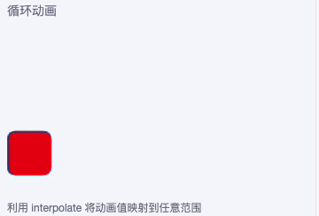
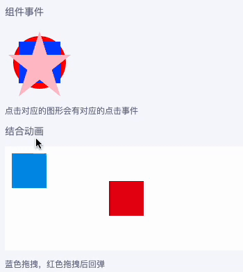

Taro系列中一直没有跨端的绘图工具，小程序端支持canvas但是不支持svg，RN端有 react-native-svg 支持svg，但是没有很好原生的canvas插件，社区的canvas都是基于WebView实现的，或者skia，这个插件的书写方式和canvas有较大的差异

所以开发了这个兼容小程序、H5和React Native 的Svg组件，来实现跨端绘图

## 前言

在小程序上面，是不支持直接编写svg代码的，但是有间接的方式让他支持，就是使用Image渲染svg，或者使用css的背景图渲染一个svg，但是这样写有一定的局限性，例如要支持动画、组件事件，将svg保存到本地等都无法实现

所以我选择了使用Canvas来模拟开发svg的相关组件支持，在RN端则是使用现在已经有的 `react-native-svg` 这个插件，因此我们只需要在小程序和H5端模拟 `react-native-svg` 组件的功能，组件属性及其功能完全按照 `react-native-svg` 规范进行开发

## 当前组件属性支持

Svg中有大量的组件，用来绘制各种图形或者图片

### 已经支持的组件

- Svg  
`width` `height` `viewBox` `preserveAspectRatio`
- Rect  
`x` `y` `width` `height`
- Circle  
`cx` `cy` `r`
- Ellipse  
`cx` `cy` `rx` `ry`
- Line  
`x1` `y1` `x2` `y2`
- Image  
`x` `y` `width` `height` `preserveAspectRatio`
- Text  
`x` `y` `dx` `dy` `fontSize` `fontWeight` `fontFamily` `textAnchor` `fontStyle`
- TSpan  
`x` `y` `dx` `dy` `fontSize` `fontWeight` `fontFamily` `textAnchor` `fontStyle`
- Polyline  
`points`
- Polygon  
`points`
- Path  
`d`
- Defs  
- Use  
`href` `x` `y`
- G
- LinearGradient  
`x1` `y1` `x2` `y2`
- RadialGradient  
`cx` `cy` `rx` `ry` `fx` `fy`
- Stop  
`offset` `stopColor` `stopOpacity`
- ClipPath

### 支持的公共属性

- id
- style
- opacity
- fill
- fillOpacity
- stroke
- strokeWidth
- strokeOpacity
- strokeLinecap
- strokeLinejoin
- strokeDasharray
- strokeDashoffset
- clipPath
- origin
- originX
- originY
- translate
- translateX
- translateY
- rotation
- scale
- scaleX
- scaleY
- skew
- skewX
- skewY
- transform (如果要使用变换动画，需要使用这个属性实现，其他变换属性RN端不支持动画)

## 动画支持

因为选择了 `react-native-svg` 作为开发参考，因此在动画支持方面，也参照了RN的相关API `Animated` 和 `Easing`

下面是一个循环动画的使用示例



```jsx
import {
  Svg, Rect,
  Animated, Easing
} from '@/duxui/components/Svg'
import { useEffect, useRef } from 'react'

const AnimatedRect = Animated.createAnimatedComponent(Rect)

const Loop = () => {

  const primary = duxappTheme.primaryColor
  const secondary = duxappTheme.secondaryColor

  const x = useRef(new Animated.Value(0)).current

  const size = 50

  useEffect(() => {
    setTimeout(() => {
      Animated.loop(
        Animated.timing(x, {
          toValue: 4,
          duration: 3000,
          easing: Easing.bounce,
          useNativeDriver: false
        })
      ).start()
    }, 500)
  }, [x])

  const width = pxNum(702)
  const height = pxNum(360)
  return <GroupList.Item title='循环动画' desc='利用 interpolate 将动画值映射到任意范围'>
    <Svg width={width} height={height}>
      <AnimatedRect
        x={x.interpolate({
          inputRange: [0, 1, 2, 3, 4],
          outputRange: [0, width - size, width - size, 0, 0]
        })}
        y={x.interpolate({
          inputRange: [0, 1, 2, 3, 4],
          outputRange: [0, 0, height - size, height - size, 0]
        })}
        width={size}
        height={size}
        rx={10} ry={10} stroke={secondary} fill={primary}
      />
    </Svg>
  </GroupList.Item>
}
```

## 组件事件

为了实现组件事件，模拟 React Native 的 `PanResponder` API，在小程序和H5端实现了相关的功能

大多数组件都支持以下触摸事件

- onPress
- onPressIn
- onPressOut
- onLongPress

下面两个示例，一个展示点击事件，一个事件结合动画实现拖拽效果



### 事件示例

下面的代码我们能看到点击不同的组件将获得对应组件的事件，这三个形状是有覆盖关系的

```jsx
const Event = () => {

  return <GroupList.Item title='组件事件' desc='点击对应的图形会有对应的点击事件'>
    <Svg width={100} height={100}>
      <Circle
        cx='50%'
        cy='50%'
        r='38%'
        fill='red'
        onPress={() => toast('点击圆形')}
      />
      <Rect
        x='20%'
        y='20%'
        width='60%'
        height='60%'
        fill='blue'
        onPress={() => toast('点击正方形')}
      />
      <Path
        d='M50,5L20,99L95,39L5,39L80,99z'
        fill='pink'
        onPress={() => toast('点击五角星')}
      />
    </Svg>
  </GroupList.Item>
}
```

### 结合动画

```jsx
const TouchEvent = () => {
  const primary = duxappTheme.primaryColor
  const secondary = duxappTheme.secondaryColor

  const movePan = useRef(new Animated.ValueXY({ x: 10, y: 10 }, { useNativeDriver: false })).current

  const moveEvent = useRef(PanResponder.create({
    onMoveShouldSetPanResponder: () => true,
    onPanResponderGrant: () => {
      movePan.setOffset({
        x: movePan.x._value,
        y: movePan.y._value
      })
    },
    onPanResponderMove: (e, gestureState) => {
      movePan.setValue({ x: gestureState.dx, y: gestureState.dy })
    },
    onPanResponderRelease: () => {
      movePan.flattenOffset()
    }
  })).current

  const moveOriginPan = useRef(new Animated.ValueXY({ x: 150, y: 50 }, { useNativeDriver: true })).current

  const moveOriginEvent = useRef(PanResponder.create({
    onMoveShouldSetPanResponder: () => true,
    onPanResponderMove: (e, gestureState) => {
      moveOriginPan.setValue({ x: gestureState.dx + 150, y: gestureState.dy + 50 })
    },
    onPanResponderRelease: () => {
      Animated.timing(moveOriginPan, {
        toValue: { x: 150, y: 50 },
        duration: 600,
        easing: Easing.bounce,
        useNativeDriver: true
      }).start()
    }
  })).current

  return <GroupList.Item title='结合动画' desc='蓝色拖拽，红色拖拽后回弹'>
    <Svg width={pxNum(702)} height={pxNum(300)}>
      <Rect width={pxNum(702)} height={pxNum(300)} fill='#fff' />
      <RectAnimated
        width={50}
        height={50}
        fill={secondary}
        {...moveEvent.panHandlers}
        x={movePan.x}
        y={movePan.y}
      />
      <RectAnimated
        width={50}
        height={50}
        fill={primary}
        {...moveOriginEvent.panHandlers}
        x={moveOriginPan.x}
        y={moveOriginPan.y}
      // translateX={moveOriginPan.x}
      // translateY={moveOriginPan.y}
      />
    </Svg>
  </GroupList.Item>
}
```

## 转换为图片

为了方便导入为图片，还封装了一个 `SvgToImage` 组件，专门将Svg导出为图片方便下一步的处理，请前往文档查看具体的使用方法

## 继续

Svg相关功能是duxui库中提供的一个组件，详情请查看duxui文档

当前UI库中的[二维码(QRCode)](https://duxapp.com/docs/duxui/show/QRCode)、[签名(Sign)](https://duxapp.com/docs/duxui/senior/Sign) 组件都是使用这个Svg组件来实现的

如果你对这个项目有兴趣，可以查看文档，继续了解详情

Svg文档：[http://duxapp.com/docs/duxui/svg](https://duxapp.com/docs/duxui/svg)

框架文档：[http://duxapp.com](http://duxapp.com)

GitHub：[https://github.com/duxapp](https://github.com/duxapp)