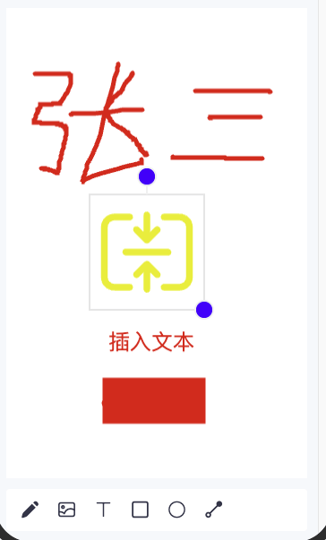

duxapp 提供了一套跨平台的 SVG 编辑器组件，支持在多种环境中创建和编辑 SVG 图形。该编辑器包含以下核心功能：

- 插入图片
- 绘制自由路径
- 添加文本
- 创建基本形状（矩形、圆形、线条等）
- 对元素进行移动、缩放和旋转操作



## 快速开始

```jsx
import { chooseMedia } from '@/duxapp/utils/net/util'
import { 
  Header, 
  TopView, 
  Column, 
  SvgEditor, 
  SvgEditorController, 
  useSvgEditorController, 
  px 
} from '@/duxui'

export default function SvgEditorExample() {
  // 获取编辑器控制器
  const context = useSvgEditorController()

  return (
    <TopView>
      <Header title='SVG编辑器' />
      <Column grow className='m-3 bg-white'>
        {/* 编辑器画布 */}
        <SvgEditor
          width='100%' 
          height='100%'
          {...context.editor}
        />
      </Column>
      {/* 编辑器控制面板 */}
      <SvgEditorController
        {...context.controller}
        selectImage={selectImage}
        className='m-3 bg-white r-1'
        style={{ height: px(100), marginTop: 0 }}
      />
    </TopView>
  )
}

// 选择图片的回调函数
const selectImage = async () => {
  const res = await chooseMedia('image', { count: 1 })
  return res[0].path
}
```

## 核心组件说明

### SvgEditor 组件

编辑器主画布，接收以下主要属性：

- defaultValue: 初始SVG内容

- onChange: 内容变更回调

- mode: 当前编辑模式（path/text/ellipse/line/rect）

- 各形状的样式属性（pathProps/textProps等）

### SvgEditorController 组件

提供可视化操作界面，主要属性：

- selectImage: 图片选择回调函数

- 继承自Column组件的布局属性

### useSvgEditorController Hook

用于获取编辑器状态和控制方法：

```js
const { editor, controller } = useSvgEditorController()
```

返回的两个属性分别用于绑定 SvgEditor 组件 和 SvgEditorController 组件

## 最后

编写这个组件主要目的是为了检验跨平台的[Svg](https://duxapp.com/docs/duxui/svg/)组件的功能完整性，同时将[源码](https://duxapp.com/docs/duxui/senior/SvgEditor)开放，供大家使用或者学习参考

[开发文档](https://duxapp.com)  
[GitHub](https://github.com/duxapp)